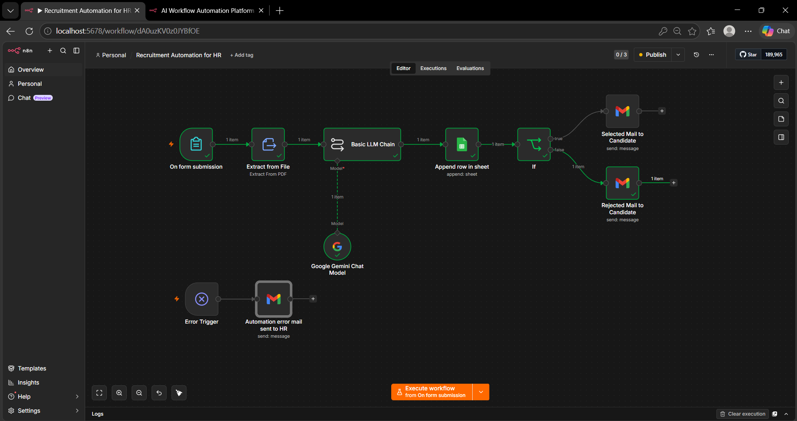
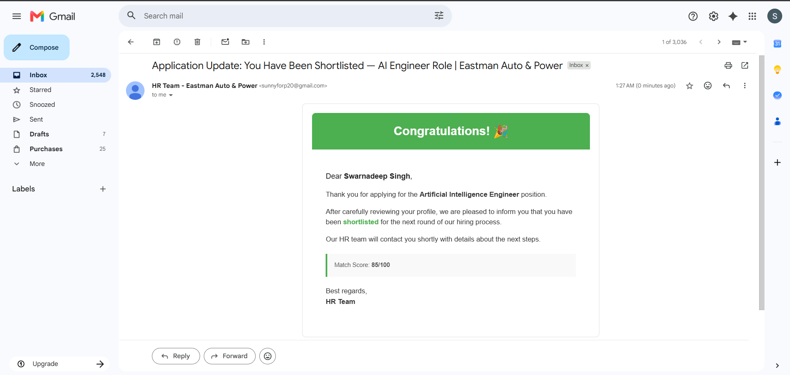
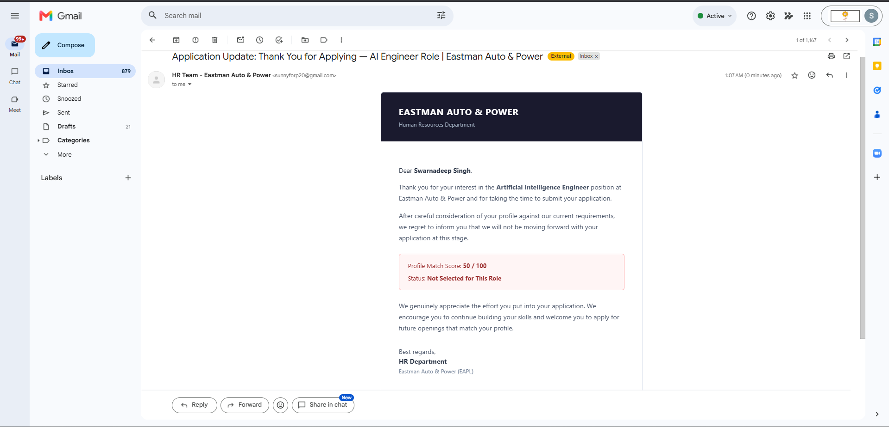
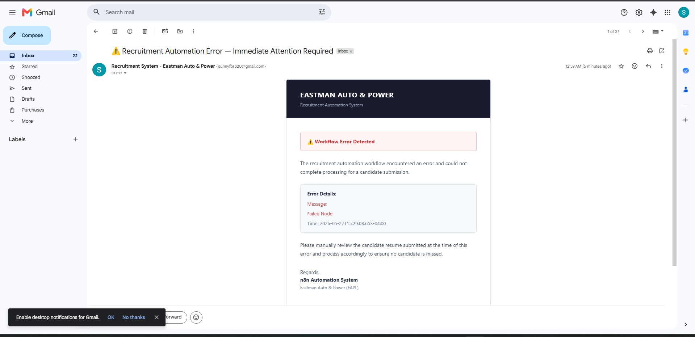
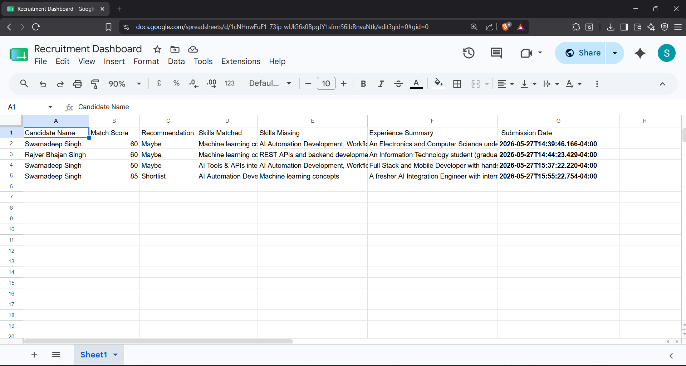

# AI Recruitment Automation System

An AI-powered recruitment workflow automation platform built using **n8n**, **Google Gemini/OpenAI APIs**, and **Google Sheets** to automate resume screening, candidate evaluation, and HR communication workflows.

---

# Main Workflow



---

# Candidate Selection Mail



---

# Rejection Workflow Mail



---

# Error Handling & HR Alert System



---

# Google Sheets Candidate Tracking



---

## Features

- AI-powered resume analysis and candidate evaluation
- Automated candidate selection and rejection workflows
- Prompt-engineered LLM evaluation pipeline
- Google Sheets integration for candidate tracking
- Automated HR email notifications
- Error-trigger monitoring and failure handling workflows
- End-to-end recruitment workflow automation

---

## Tech Stack

- n8n
- Google Gemini / OpenAI API
- Google Sheets API
- Gmail API
- Prompt Engineering
- Workflow Automation

---

# Workflow Architecture

The workflow automates the complete recruitment pipeline:

1. Candidate submits resume
2. Resume content extracted from PDF
3. LLM evaluates candidate profile
4. Candidate score stored in Google Sheets
5. Automated selection/rejection email triggered
6. Error handling workflow alerts HR on failures

---

# Key Highlights

- Built reusable prompt templates for scalable candidate evaluation
- Implemented automated HR notification workflows
- Designed production-style error handling using n8n Error Trigger nodes
- Improved recruitment workflow efficiency through AI-driven automation

---
   
# Repository Structure

```bash
ai-recruitment-automation/
│
├── README.md
├── workflow.json
├── prompts/
│   └── resume_prompt.txt
├── screenshots/
│   ├── Full_Canvas.png
│   ├── Selected_Mail.png
│   ├── Rejected_Mail.png
│   ├── Error_Mail_to_HR.png
│   └── Google_Sheets.png
├── docs/
│   └── architecture.md
